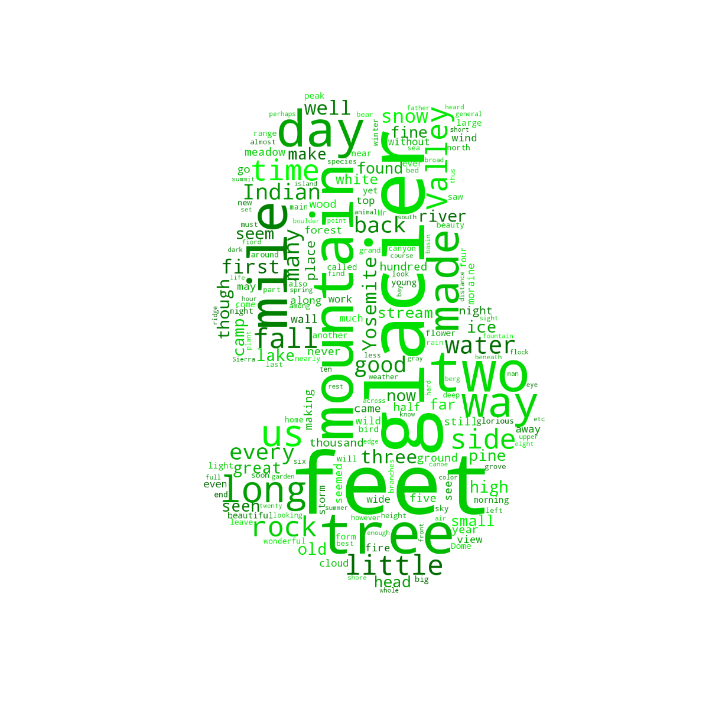

# A NLP and Data Visualization Work in Progress Using Spark

##### This project is a collaboration with <a href="https://github.com/coradek">Evan Adkins</a> and <a href="https://github.com/SydneyLauren">Sydney Decoto</a>. Five works each by Jane Austen, Charles Dickens, Mark Twain, and John Muir were selected for comparison. More work will be added as the project progresses.

#### Figure 1: Wordcloud for works by Jane Austen.
 

#### Figure 2: Wordcloud for works by John Muir.
 

#### Figure 3: Wordcloud for works by Charles Dickens.
 

#### Figure 4: Wordcloud for works by Mark Twain.
 

#### Figure 5: All four authors average around 4.5 letters per word  with John Muir coming in slightly above the others.
 

#### Figure 6: Charles Dickens, Mark Twain, and Jane Austen average between 20-25 words per sentence with John Muir averaging around 28 words per sentence. Interestingly, John Muir's distribution does not display the skewness of the other authors.
 

