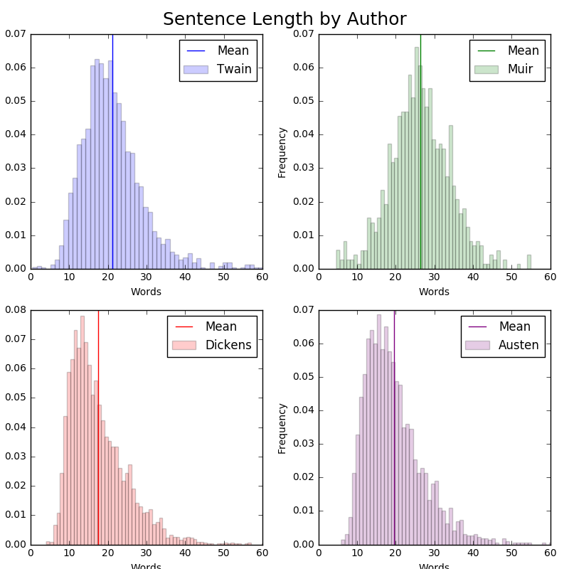

# A NLP and Data Visualization Work in Progress Using Spark

##### This project is a collaboration with <a href="https://github.com/coradek">Evan Atkins</a> and <a href="https://github.com/SydneyLauren">Sydney Decoto</a>. Five works each by Jane Austen, Charles Dickens, Mark Twain, and John Muir were selected for comparison. More work will be added as the project progresses.

#### Figure 1: Average letters per word in each excerpt.
 

#### Figure 2: Average words per sentence in each excerpt.
 

