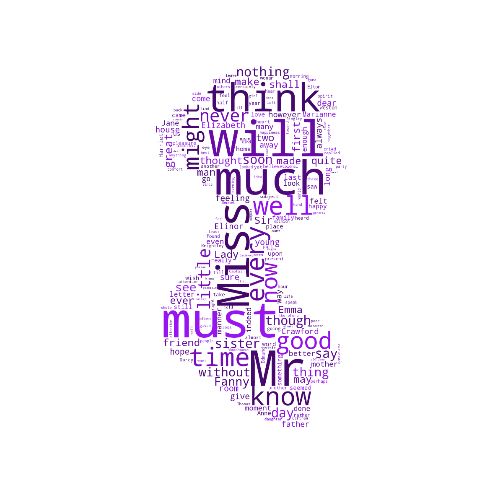
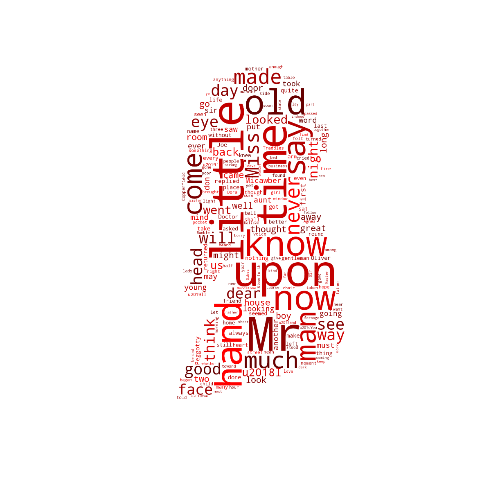

# A NLP and Data Visualization Work in Progress Using Spark

This project is a collaboration with <a href="https://github.com/coradek">Evan Adkins</a> and <a href="https://github.com/SydneyLauren">Sydney Decoto</a>. Five works each by Jane Austen, Charles Dickens, Mark Twain, and John Muir were selected for comparison. The goals of this project were use Spark's ML library for author recognition and to generate some visuals.

The texts were split into 200 to 400 word excerpts. A custom spaCy transformer was used to tokenize the excerpts. spaCy is a fast, open-source NLP tool capable of large-scale tasks. Spark's built-in transformers were used to create TF-IDF vectors for the excerpts.

As you can tell from the word clouds below word clouds, terms frequently used by each author are quite different. A 75/25 train/test split was made on the data. K-Fold cross validation was used to tune Spark's Naive Bayes, Decision Tree, Random Forrest classifiers. All were all highly successful at identifying the authorship on the test data. In retrospect, we should have chosen a more challenging task such as selecting authors writing in the same genre and era.

**Results:**  Accuracy of classification models on test data.

| Models        | Accuracy   |
|---------------|------------|
| Naive Bayes   | 0.991634   |
| Decision Tree | 0.965149   |
| Random Forrest| 0.997794   |

**Figure 1: Wordcloud for works by Jane Austen.**
 

**Figure 2: Wordcloud for works by John Muir.**
 

**Figure 3: Wordcloud for works by Charles Dickens.**
 

**Figure 4: Wordcloud for works by Mark Twain.**
 

